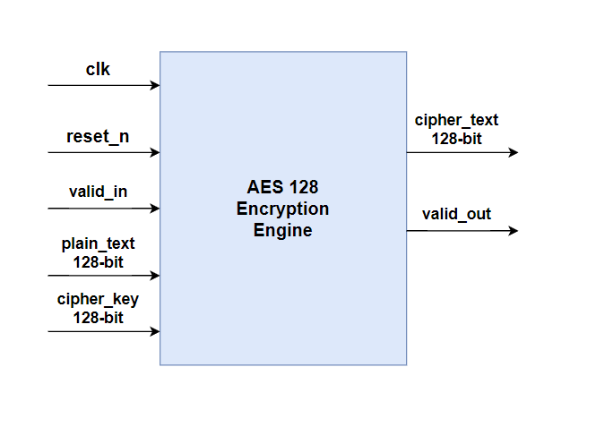
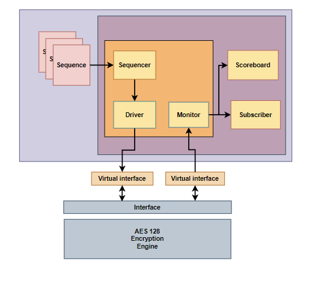

# AES Encryption Standard Implementation

A complete hardware implementation of the Advanced Encryption Standard (AES) with comprehensive verification infrastructure, system modeling, and documentation.

## Overview

This repository contains a full-stack AES encryption implementation featuring RTL design, UVM-based verification environment, system-level modeling, and detailed documentation. The implementation supports standard AES key sizes and includes comprehensive coverage analysis.

## Features

- **Complete AES Implementation**: Hardware RTL supporting AES-128/192/256
- **UVM Verification**: Industry-standard verification methodology
- **System Modeling**: High-level behavioral models for early validation
- **Comprehensive Coverage**: Functional and structural coverage analysis
- **Documentation**: Detailed design specifications and user guides

## Architecture

## Test Bench

## Results

Test results and coverage reports:
- `Fcover_report.txt`: Functional coverage
- `Scover_report.txt`: Code coverage
